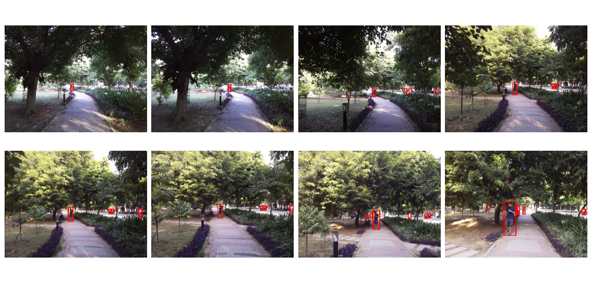
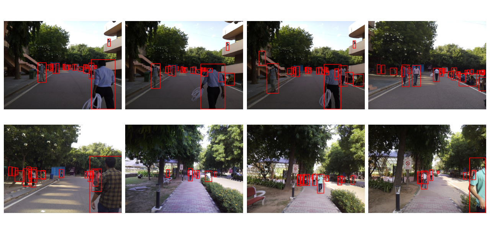
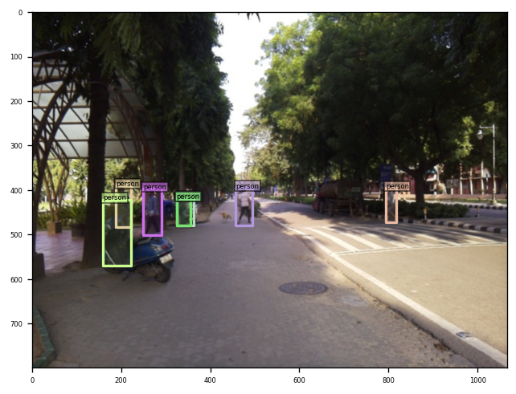
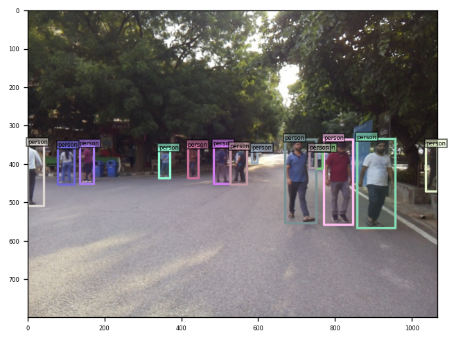
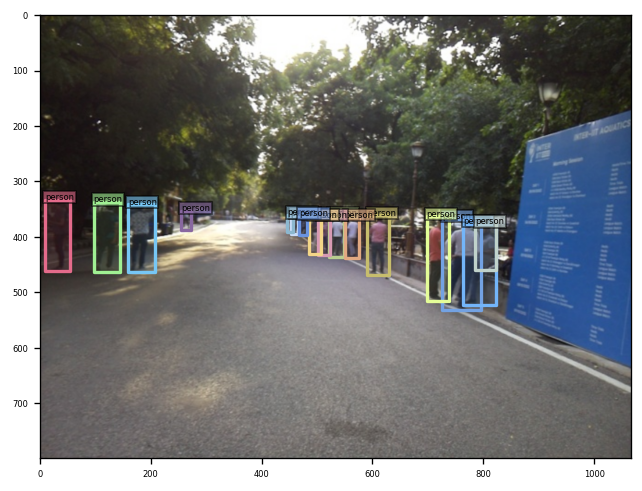
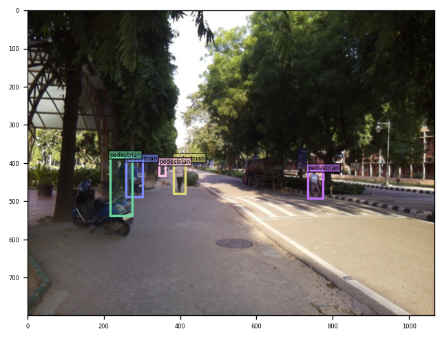
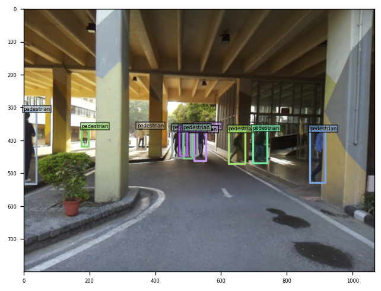
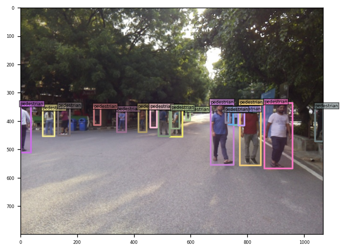

# Pedestrian Detection using DINO Object Detection Model

This repository contains the implementation of a task assigned as part of the Computer Vision and Machine Learning Internship at the **Vision and Graphics Lab, Department of CSE, IIT Delhi**. The task involves training and fine-tuning the DINO object detection model on a pedestrian dataset collected within the IIT Delhi campus.

Link for finetuned model [Finetune Model](https://drive.google.com/file/d/1PYHIIyJ_BZ8DyBIv--zWoXm3qBCesOXg/view?usp=drive_link)

---

## Table of Contents

- [Project Overview](#project-overview)
- [Dataset Preparation](#dataset-preparation)
- [Repository Setup](#repository-setup)
- [Evaluation](#evaluation)
- [Fine-tuning](#fine-tuning)
- [Results](#results)
- [Steps to Recreate](#steps-to-recreate)
- [Report](#report)

---

## Project Overview

The goal of this project is to train the DINO object detection model on a pedestrian dataset consisting of 200 images. The dataset is annotated in COCO format. The project involves visualizing the bounding boxes, evaluating the model, fine-tuning it, and analyzing its performance on a validation set.

---
## Dataset Visualization

To better understand the dataset, we visualize the bounding boxes of pedestrian annotations in the images.

### Script for Bounding Box Visualization:
- **Script**: `bb_visulaize.py`
- This script loads the images and corresponding COCO annotations, draws bounding boxes around the pedestrians (as labelled), and displays the result.

### How to run the script:

1. Ensure you have installed the necessary dependencies, including OpenCV and Matplotlib.
   ```sh
   pip install matplotlib opencv-python
    ```
2. Run the visualization script:
   ```sh
   python bb_visulaize.py
   ```



---


The script will display a set of images with bounding boxes drawn in red, showing where the pedestrians are located in the images.

---
## Dataset Preparation

1. The dataset consists of 200 images with corresponding annotations in COCO format.
2. **Split the dataset** into two sets:
   - Training set: 160 images
   - Validation set: 40 images
3. A Python script is provided to automate the dataset splitting process:
   - **Script**: `train_val_split.py`
   - This script reads the dataset and annotations, splits them into training and validation sets, and saves the result in the respective directories.
   
### How to run the script:
   ```sh
   python train_val_split.py 
   ```
```
custom_dataset/
  ├── train_images/
  ├── val_images/
  └── annotations/
  	├── instances_train_imagesd.json
  	└── instances_val_images.json
```
---

## Repository Setup

1. **Clone the DINO repository** from the following link: [DINO GitHub Repo](https://github.com/IDEA-Research/DINO#installation).
   
2. **Set up the environment** follow the instructions given below

## Installation
> **_NOTE:_** Same as the original reposetory
  
  We use the environment same to DAB-DETR and DN-DETR to run DINO. If you have run DN-DETR or DAB-DETR, you can skip this step. 
  We test our models under ```python=3.7.3,pytorch=1.9.0,cuda=11.1```. Other versions might be available as well. Click the `Details` below for more details.

   1. Clone this repo
   ```sh
   git clone https://github.com/IDEA-Research/DINO.git
   cd DINO
   ```

   2. Install Pytorch and torchvision

   Follow the instruction on https://pytorch.org/get-started/locally/.
   ```sh
   # an example:
   conda install -c pytorch pytorch torchvision
   ```

   3. Install other needed packages
   ```sh
   pip install -r requirements.txt
   ```

   4. Compiling CUDA operators
   ```sh
   cd models/dino/ops
   python setup.py build install
   # unit test (should see all checking is True)
   python test.py
   cd ../../..
   ```


---

## Evaluation

1. Download the pre-trained DINO-4scale model with the ResNet-50 (R50) backbone from the DINO repository.
2. Modify the configuration file to point to the pedestrian dataset.
3. Run the evaluation script to evaluate the pre-trained model on the validation set (40 images).
```sh
!bash /content/scripts/DINO_eval.sh /content/custom_dataset /content/checkpoint0011_4scale.pth
```
4. Report the bounding box Average Precision (AP) values.

Some of the visiualization of pre_trained model's prediction on validation data


---


---


> **_NOTE:_** Encountered some errors..resolved by

> TypeError: FormatCode() got an unexpected keyword argument 'verify'
```sh
!pip install yapf==0.40.1
```
> np.float is depreciated in latest version so need to downgrade numpy

```sh
!pip install "numpy<1.24"
```


---

## Fine-tuning

1. Fine-tune the pre-trained model on the pedestrian training set (160 images).
* added two more arguments in the config/DINO/DINO_4scale.py
```
--finetune_ignore label_enc.weight class_embed

--pretrain_model_path /content/checkpoint0011_4scale.pth
```
2. After fine-tuning, evaluate the model again on the validation set.

Link for finetuned model [Finetune Model](https://drive.google.com/file/d/1PYHIIyJ_BZ8DyBIv--zWoXm3qBCesOXg/view?usp=drive_link)



---


---

---

## Results

## Evaluation

The model was evaluated on the pedestrian detection dataset using the COCO-style metrics. Below are the key evaluation metrics obtained:

### Initial Evaluation (Pre-trained model)


| Metric                                             | Value  |
|----------------------------------------------------|--------|
| Bounding Box AP (IoU=0.50:0.95, area=all)          | 52.8   |
| Bounding Box AP (IoU=0.50, area=all)               | 88.2   |
| Bounding Box AP (IoU=0.75, area=all)               | 59.3   |
| Average Recall (IoU=0.50:0.95, maxDets=100)        | 61.8   |
| Average Recall (IoU=0.50:0.95, area=medium)        | 70.3   |
| Average Recall (IoU=0.50:0.95, area=large)         | 71.2   |


### Loss Values:

During the training and evaluation, the model's losses were recorded as follows:

- **Class Error**: 0.00
- **Total Loss**: 5.1748
- **Loss (bbox)**: 0.0777
- **Loss (giou)**: 0.4392
- **Loss (ce)**: 0.1641

These metrics indicate the model’s performance in detecting pedestrians, with high precision and recall for medium and large objects, and slightly lower performance for small objects.

### Fine-tuned Model Evaluation

| Metric                                             | Value  |
|----------------------------------------------------|--------|
| Bounding Box AP (IoU=0.50:0.95, area=all)          | 58.3   |
| Bounding Box AP (IoU=0.50, area=all)               | 91.1   |
| Bounding Box AP (IoU=0.75, area=all)               | 67.6   |
| Average Recall (IoU=0.50:0.95, maxDets=100)        | 70.4   |
| Average Recall (IoU=0.50:0.95, area=medium)        | 78.1   |
| Average Recall (IoU=0.50:0.95, area=large)         | 80.6   |


### Loss Values:

During the training and evaluation, the model's losses were recorded as follows:

- **Class Error**: 0.00
- **Total Loss**: 3.9371
- **Loss (bbox)**: 0.0565
- **Loss (giou)**: 0.3790
- **Loss (ce)**: 0.0692

These metrics indicate the model’s performance in detecting pedestrians,with high precision and recall for medium and large objects, and somewhat lower performance for small objects

### Model Performance Summary
The metrics show a clear improvement in the model's performance after the finetune on custom dataset

---

> **_NOTE:_** Data Preparation was carried out on local machine then pushed to google drive. Model Training and Evaluation were performed in Google Colab Notebook with T4 GPU as Runtime 


